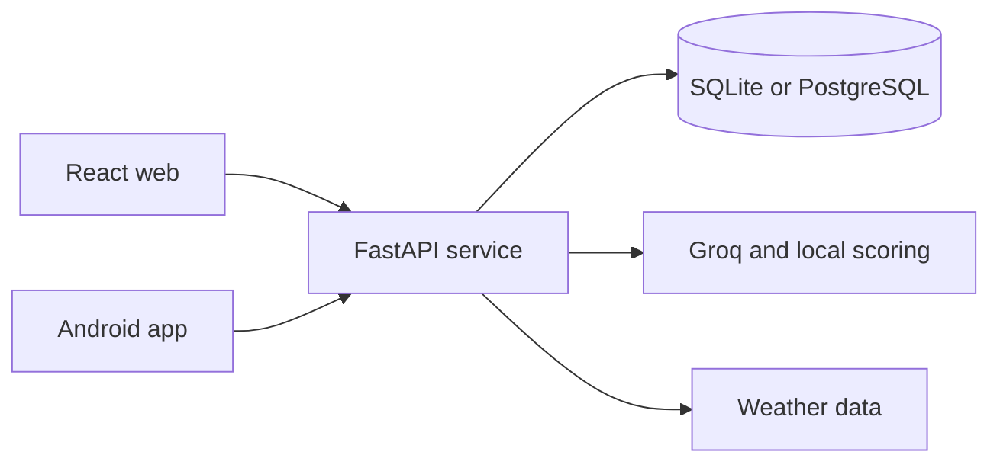

# FitGPT

Full-stack AI wardrobe platform spanning the web, a REST API, and native Android.

[Live app](https://fitgpt.tech) · [Engineering docs](./docs/README.md) · [Report an issue](../../issues)

FitGPT helps users organize a digital wardrobe and receive explainable outfit recommendations grounded in their preferences, clothing inventory, weather, time, and wear history. The product combines a React experience, a FastAPI service, persistent data, and a Kotlin Android client while preserving local-first fallbacks for core flows.

## Engineering proof

| Area | Implementation |
| --- | --- |
| Web | React, React Router, Three.js, TensorFlow.js, Recharts |
| API | FastAPI, SQLAlchemy, JWT authentication, Google OAuth |
| Data | SQLite or PostgreSQL with users, wardrobe items, outfits, plans, and feedback |
| AI and context | Groq-backed recommendations, AURA assistant, MobileNet tagging, weather context |
| Mobile | Kotlin, Jetpack Compose, Retrofit |
| Quality | 185+ backend tests and 617 web tests; CI runs tests and a production web build |
| Delivery | Vercel, Render, and GitHub Actions |

## Product capabilities

- Digital wardrobe CRUD, bulk upload, filtering, duplicate detection, and item reuse insights
- Explainable outfit recommendations scored for style, fit, color, season, weather, and history
- AURA conversational styling assistant with deterministic fallback behavior
- Weekly outfit planning and forecast-aware trip packing
- Saved outfits, favorites, wear history, and preference-based feedback
- 3D outfit preview and a drag-and-drop builder
- Secure account flows with JWT and Google OAuth
- Responsive web UI plus a native Android client

## Architecture



Core wardrobe workflows degrade gracefully to browser storage when the backend is unavailable. Server-backed authentication, synchronization, and AI enhancements layer on top of that local-first experience.

## Repository map

```text
FitGPT/
├── backend/          FastAPI application, data models, AI services, and tests
├── web/              React wardrobe experience and test suite
├── app/              Native Kotlin / Jetpack Compose client
├── docs/             Product, architecture, API, and release documentation
└── .github/workflows Continuous integration
```

## Run locally

### Backend

```bash
cd backend
python -m venv .venv
source .venv/bin/activate        # Windows: .venv\Scripts\activate
pip install -r requirements.txt
cp .env.example .env
uvicorn app.main:app --reload
```

Configure the values documented in `backend/.env.example`, including the database and any optional external-service credentials.

### Web

```bash
cd web
npm install
npm run dev
```

### Android

Open the repository root in Android Studio, use an Android SDK compatible with API 36, and run the `app` configuration on an emulator or device (minimum API 26).

## Test and verify

```bash
cd backend && pytest
cd web && npm run test:ci
cd web && npm run build
```

GitHub Actions runs the backend suite on Python 3.12 and the frontend checks on Node 20.

## Responsible AI notes

AI-generated outfit suggestions are recommendations, not ground truth. Production use should preserve the current explainability and fallback paths while adding model-output monitoring, clear data-retention controls, user correction mechanisms, and careful handling of uploaded wardrobe images and preference data.

## Author

Built by [Muhammad Imran](https://github.com/Muhammad7839) — [portfolio](https://muhammad7839.github.io/portfolio) · [LinkedIn](https://www.linkedin.com/in/muhammadimran-swe/)
