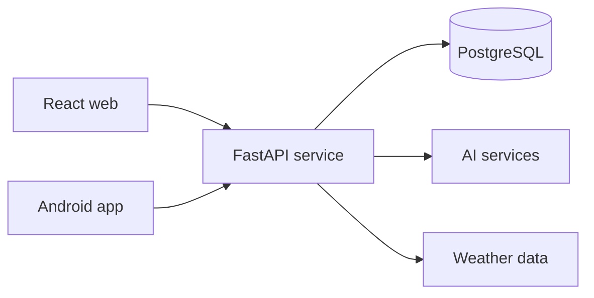

# FitGPT

Full-stack AI fitness platform spanning the web, a REST API, and native Android.

[Live app](https://fitgpt.tech) · [Engineering docs](./docs/README.md) · [Report an issue](../../issues)

FitGPT turns a user's goals, activity, and context into practical workout and nutrition guidance. The product combines a React experience, a FastAPI service, PostgreSQL persistence, and an Android client while keeping AI-generated recommendations reviewable and grounded in user input.

## Engineering proof

| Area | Implementation |
| --- | --- |
| Web | React 19, React Router 7, Three.js, TensorFlow.js, Recharts |
| API | FastAPI, SQLAlchemy, JWT authentication, Google OAuth |
| Data | PostgreSQL with modeled user, workout, nutrition, and progress data |
| AI and context | Groq-backed generation, TensorFlow.js features, OpenWeather context |
| Mobile | Kotlin, Jetpack Compose, Retrofit |
| Quality | 185+ backend tests and 617 web tests; CI runs tests and a production web build |
| Delivery | Vercel, Render, and GitHub Actions |

## Product capabilities

- Personalized workout and nutrition workflows
- Progress, goal, and activity tracking with visual analytics
- Secure account flows with JWT and Google OAuth
- Context-aware recommendations that can incorporate weather conditions
- Responsive web UI plus a native Android client
- Shared REST API contracts across clients

## Architecture



## Repository map

```text
FitGPT/
├── backend/          FastAPI application, database models, and tests
├── web/              React web client and test suite
├── app/              Native Kotlin / Jetpack Compose client
├── docs/             Engineering and feature documentation
└── .github/workflows Continuous integration
```

## Run locally

### Backend

```bash
cd backend
python -m venv .venv
source .venv/bin/activate        # Windows: .venv\Scripts\activate
pip install -r requirements.txt
cp .env.example .env
uvicorn app.main:app --reload
```

Configure the values documented in `backend/.env.example`, including the database and any optional external-service credentials.

### Web

```bash
cd web
npm install
npm run dev
```

### Android

Open the repository root in Android Studio, use an Android SDK compatible with API 36, and run the `app` configuration on an emulator or device (minimum API 26).

## Test and verify

```bash
cd backend && pytest
cd web && npm run test:ci
cd web && npm run build
```

GitHub Actions runs the backend suite on Python 3.12 and the frontend checks on Node 20.

## Responsible AI notes

FitGPT is a software portfolio project, not a substitute for professional medical advice. Generated guidance should be treated as a starting point, especially when a user has an injury, medical condition, or dietary restriction. Production deployments should pair model output with clear provenance, validation, privacy controls, and observability.

## Author

Built by [Muhammad Imran](https://github.com/Muhammad7839) — [portfolio](https://muhammad7839.github.io/portfolio) · [LinkedIn](https://www.linkedin.com/in/muhammadimran-swe/)
